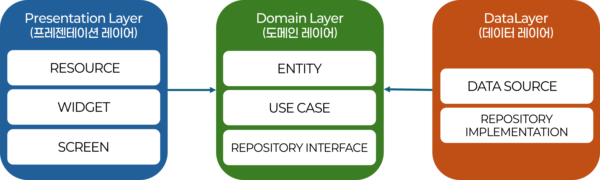

# 레이어 구조 상세 설명

Clean Architecture는 3개의 주요 레이어로 구성됩니다. 각 레이어의 역할과 특징을 설명합니다.

## 레이어 구조 개요



## 1. Presentation Layer (프레젠테이션 레이어)

**위치**: `lib/presentation/`

### 책임

- 사용자 인터페이스 표시
- 사용자 입력 처리
- Domain 레이어의 Use Case 호출
- 상태 관리 (UI 상태)

### 구성 요소

- **`screens/`**: 화면 위젯 (Pages)
  - 예: `deviceInfo/deviceInfo_main.dart`, `gps/gps_main.dart` 등
- **`widgets/`**: 재사용 가능한 UI 컴포넌트
  - 예: `appbar.dart`, `button.dart`, `infobox.dart` 등
- **`resources/`**: 색상, 텍스트 스타일 등 UI 리소스
  - 예: `color_style.dart`, `text_style.dart` 등

### 특징

- Domain 레이어에만 의존
- Flutter 프레임워크에 의존 (UI 렌더링)
- Use Case를 통해서만 비즈니스 로직 접근

### 실제 코드 예시

```dart
// presentation/screens/deviceInfo/deviceInfo_main.dart
class _DeviceInfoPageState extends State<DeviceInfoPage> {
  late final DeviceUseCase _deviceUseCase;

  @override
  void initState() {
    super.initState();
    _deviceUseCase = getIt<DeviceUseCase>(); // 의존성 주입
  }

  Future<void> _getDeviceInfo() async {
    try {
      deviceInfo = await _deviceUseCase.getDeviceInfo(); // Use Case 호출
    } catch (e) {
      ErrorHandler.showErrorDialog(context, e.toString());
    }
  }
}
```

**핵심**: Presentation은 **Use Case**를 통해서만 비즈니스 로직에 접근합니다!

---

## 2. Domain Layer (도메인 레이어)

**위치**: `lib/domain/`

### ⚠️ 중요: Domain 레이어는 외부 라이브러리에 의존하면 안 됩니다!

### 책임

- 비즈니스 로직 정의
- 비즈니스 규칙 구현
- 엔티티 정의
- Use Case 정의

### 구성 요소

- **`entities/`**: 비즈니스 객체 (순수 Dart 클래스)
  - 예: `DeviceInfo`, `GpsInfo`, `AcceleratorInfo` 등
- **`repositories/`**: 데이터 접근 인터페이스 (추상 클래스)
  - 예: `DeviceRepository`, `GpsRepository` 등
- **`usecases/`**: 비즈니스 로직 실행 단위
  - 예: `DeviceUseCase`, `GpsUseCase` 등

### 특징

- **외부 의존성 없음**: Flutter, HTTP, 데이터베이스 등에 의존하지 않음
- **순수 Dart 코드**: 플랫폼 독립적
- **테스트 용이**: Mock 객체 없이도 테스트 가능

### 실제 코드 예시

#### Entity (순수 Dart 클래스)

```dart
// domain/entities/device_info.dart
class DeviceInfo {
  final int sn;
  final String uuid;
  final String os;
  // ... 기타 필드

  DeviceInfo({
    required this.sn,
    required this.uuid,
    required this.os,
    // ...
  });

  factory DeviceInfo.fromJson(Map<String, dynamic> json) {
    // JSON 역직렬화
  }

  Map<String, dynamic> toJson() {
    // JSON 직렬화
  }
}
```

**특징**: 외부 라이브러리 없이 순수 Dart 코드만 사용

#### Repository Interface (추상 클래스)

```dart
// domain/repositories/device_repository.dart
abstract class DeviceRepository {
  Future<DeviceInfo> getDeviceInfo();
  Future<bool> uploadDeviceInfo(DeviceInfo deviceInfo);
  Future<List<DeviceInfo>> getDeviceList(String uuid);
}
```

**특징**: 인터페이스만 정의, 구현 세부사항 없음

#### Use Case (비즈니스 로직)

```dart
// domain/usecases/device_usecase.dart
class DeviceUseCase {
  final DeviceRepository repository;  // 인터페이스에 의존

  DeviceUseCase(this.repository);

  Future<DeviceInfo> getDeviceInfo() async {
    return await repository.getDeviceInfo();
  }

  Future<bool> uploadDeviceInfo(DeviceInfo deviceInfo) async {
    return await repository.uploadDeviceInfo(deviceInfo);
  }
}
```

**특징**: 인터페이스에만 의존, 외부 라이브러리 사용 불가

---

## 3. Data Layer (데이터 레이어)

**위치**: `lib/data/`

### 책임

- 외부 데이터 소스 접근
- API 호출
- 로컬 데이터베이스 관리
- 파일 시스템 접근

### 구성 요소

- **`datasources/`**: 실제 데이터 소스 접근 (API, 로컬 파일 등)
  - 예: `DeviceService`, `GpsService` 등
- **`repositories/`**: Domain 레이어의 Repository 인터페이스 구현
  - 예: `DeviceRepositoryImpl`, `GpsRepositoryImpl` 등

### 특징

- Domain 레이어의 인터페이스를 구현
- 외부 라이브러리 사용 (HTTP, 파일 시스템 등)
- 데이터 변환 (JSON ↔ Entity)

### 실제 코드 예시

#### Repository Implementation

```dart
// data/repositories/device_repository_impl.dart
class DeviceRepositoryImpl implements DeviceRepository {
  DeviceRepositoryImpl();

  @override
  Future<DeviceInfo> getDeviceInfo() async {
    return await DeviceService.getDeviceInfo(); // Data Source 호출
  }

  @override
  Future<bool> uploadDeviceInfo(DeviceInfo deviceInfo) async {
    return await DeviceService.uploadDeviceInfo(deviceInfo);
  }
}
```

**특징**: Domain 인터페이스를 구현하고, Data Source를 호출

#### Data Source (Service)

```dart
// data/datasources/device_service.dart
class DeviceService {
  static Future<DeviceInfo> getDeviceInfo() async {
    final deviceInfoPlugin = DeviceInfoPlugin(); // 외부 라이브러리 사용
    final uuid = await getPersistentUuid();
    // ... 실제 데이터 수집 로직
    return DeviceInfo(/* ... */);
  }

  static Future<bool> uploadDeviceInfo(DeviceInfo info) async {
    final uri = Uri.parse(AppConfig.getDeviceUrl('/insertDeviceInfo.do'));
    final resp = await http.post(uri, body: fields); // HTTP 라이브러리 사용
    // ...
  }
}
```

**특징**: 외부 라이브러리를 자유롭게 사용 가능

---

## 레이어 간 의존성 규칙

### 의존성 방향

```
Presentation → Domain ← Data
```

**규칙**:
1. **Presentation**은 **Domain**에만 의존
2. **Domain**은 외부 레이어에 의존하지 않음 (인터페이스만 정의)
3. **Data**는 **Domain**의 인터페이스를 구현

### 예시

```dart
// ✅ 올바른 예시: Domain이 인터페이스에만 의존
// domain/usecases/device_usecase.dart
class DeviceUseCase {
  final DeviceRepository repository;  // ✅ 인터페이스에 의존
  
  // ...
}

// domain/repositories/device_repository.dart
abstract class DeviceRepository {  // Domain에 인터페이스 정의
  Future<DeviceInfo> getDeviceInfo();
}

// data/repositories/device_repository_impl.dart
class DeviceRepositoryImpl implements DeviceRepository {  // Data에서 구현
  // ...
}
```

---

## 레이어별 비교표

| 구분 | Presentation Layer | Domain Layer | Data Layer |
|------|-------------------|--------------|------------|
| **위치** | `lib/presentation/` | `lib/domain/` | `lib/data/` |
| **의존성** | Domain에만 의존 | 외부 의존성 없음 | Domain 인터페이스 구현 |
| **외부 라이브러리** | UI 프레임워크 사용 가능 | 사용 불가 | 자유롭게 사용 가능 |
| **책임** | UI 표시, 입력 처리 | 비즈니스 로직 | 데이터 접근 |
| **테스트** | UI 테스트 필요 | 순수 코드로 테스트 가능 | Mock 데이터로 테스트 |

