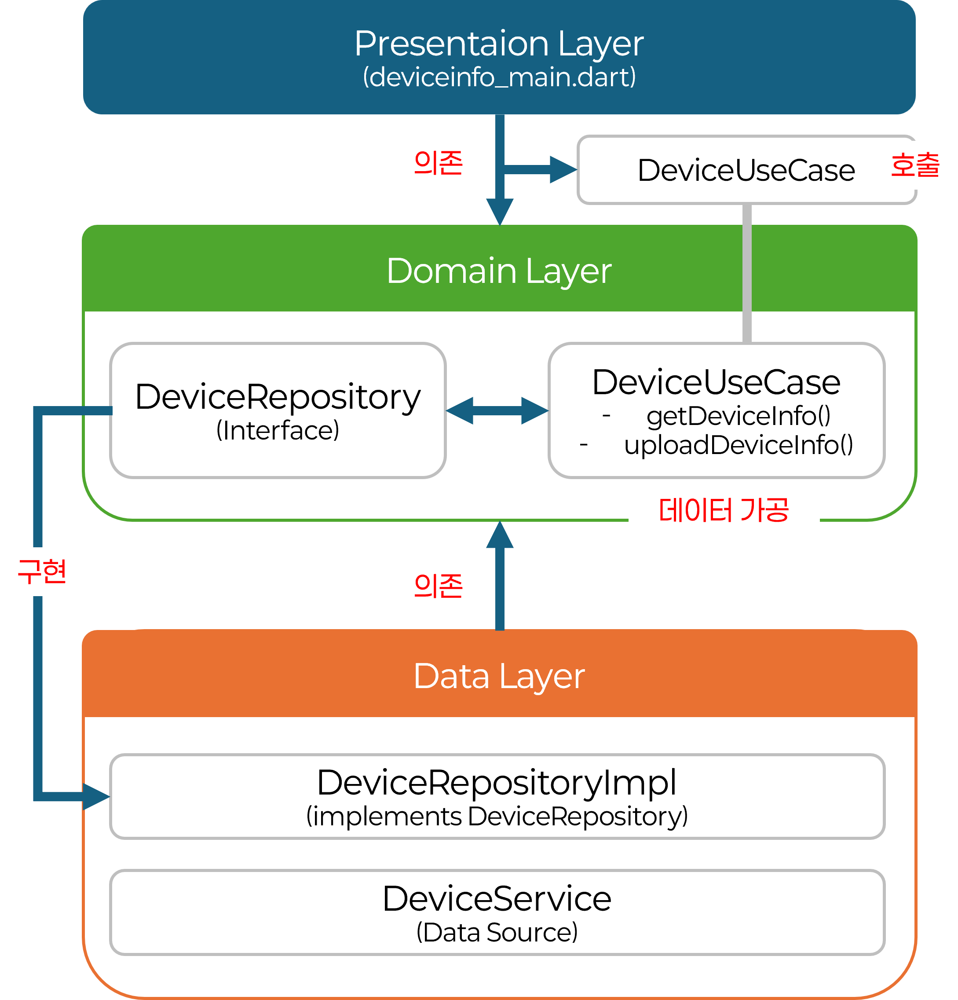

# 의존성 역전 원칙 (Dependency Inversion Principle)

## 전통적인 방식 vs Clean Architecture 방식

### 전통적인 방식

```
Presentation → Domain → Data
```

**문제점**:
- Domain이 구체적인 Data 구현체를 직접 참조
- Data 구현체를 바꾸려면 Domain 코드도 수정해야 함

### Clean Architecture 방식 (의존성 역전)

```
Presentation → Domain ← Data
```

## 핵심 원칙

### 1. 의존성 역전 원칙 (Dependency Inversion Principle)

- Domain 레이어는 **추상화(인터페이스)**에 의존
- Data 레이어는 Domain 레이어의 인터페이스를 **구현**
- Presentation 레이어는 Domain 레이어의 Use Case를 사용

### 2. 단일 책임 원칙 (Single Responsibility Principle)

각 레이어와 클래스는 하나의 명확한 책임만 가집니다:

- **Presentation Layer**: UI 렌더링, 사용자 입력 처리
- **Domain Layer**: 비즈니스 로직, 규칙 정의
- **Data Layer**: 데이터 소스 접근, API 호출, 로컬 저장소 관리

### 3. 인터페이스 분리 원칙 (Interface Segregation Principle)

클라이언트는 사용하지 않는 인터페이스에 의존하지 않아야 합니다. Repository 인터페이스는 필요한 메서드만 정의합니다.

### 4. 개방-폐쇄 원칙 (Open-Closed Principle)

- **확장에는 열려있고**: 새로운 기능 추가 시 기존 코드 수정 없이 확장 가능
- **수정에는 닫혀있음**: 기존 코드를 변경하지 않고도 새로운 구현체 추가 가능


## 의존성 흐름 다이어그램
### [예시] DeviceInfo Application



## 의존성 역전의 구현 (단계별 설명)

### 1단계: Domain 레이어에서 인터페이스 정의

```dart
// domain/repositories/device_repository.dart
abstract class DeviceRepository {
  Future<DeviceInfo> getDeviceInfo();
  Future<bool> uploadDeviceInfo(DeviceInfo deviceInfo);
  Future<List<DeviceInfo>> getDeviceList(String uuid);
}
```

**핵심**: 인터페이스는 **Domain 레이어**에 위치

### 2단계: Data 레이어에서 인터페이스 구현

```dart
// data/repositories/device_repository_impl.dart
class DeviceRepositoryImpl implements DeviceRepository {
  DeviceRepositoryImpl();

  @override
  Future<DeviceInfo> getDeviceInfo() async {
    return await DeviceService.getDeviceInfo();
  }

  @override
  Future<bool> uploadDeviceInfo(DeviceInfo deviceInfo) async {
    return await DeviceService.uploadDeviceInfo(deviceInfo);
  }

  @override
  Future<List<DeviceInfo>> getDeviceList(String uuid) async {
    return await DeviceService.fetchDeviceInfoList(uuid);
  }
}
```

**핵심**: 구현체는 **Data 레이어**에 위치하고, Domain의 인터페이스를 구현

### 3단계: Domain 레이어에서 Use Case 정의

```dart
// domain/usecases/device_usecase.dart
class DeviceUseCase {
  final DeviceRepository repository;  // 인터페이스에 의존

  DeviceUseCase(this.repository);

  Future<DeviceInfo> getDeviceInfo() async {
    return await repository.getDeviceInfo();
  }

  Future<bool> uploadDeviceInfo(DeviceInfo deviceInfo) async {
    return await repository.uploadDeviceInfo(deviceInfo);
  }

  Future<List<DeviceInfo>> getDeviceList(String uuid) async {
    return await repository.getDeviceList(uuid);
  }
}
```

**핵심**: Use Case는 **인터페이스**에만 의존하고, 구현체는 알지 못함

### 4단계: Presentation 레이어에서 Use Case 사용

```dart
// presentation/screens/deviceInfo/deviceInfo_main.dart
class _DeviceInfoPageState extends State<DeviceInfoPage> {
  late final DeviceUseCase _deviceUseCase;

  @override
  void initState() {
    super.initState();
    _deviceUseCase = getIt<DeviceUseCase>(); // 의존성 주입
  }

  Future<void> _getDeviceInfo() async {
    try {
      deviceInfo = await _deviceUseCase.getDeviceInfo();
    } catch (e) {
      ErrorHandler.showErrorDialog(context, e.toString());
    }
  }
}
```

**핵심**: Presentation은 **Use Case**를 통해서만 비즈니스 로직에 접근

### 5단계: 의존성 주입 설정

```dart
// di/injection_container.dart
void setupDependencies() {
  // Repository 구현체 등록
  getIt.registerLazySingleton<DeviceRepository>(
    () => DeviceRepositoryImpl(),
  );

  // Use Case 등록 (Repository 주입)
  getIt.registerLazySingleton<DeviceUseCase>(
    () => DeviceUseCase(getIt()),
  );
}
```

**핵심**: GetIt을 통해 의존성을 주입하고, Clean Architecture의 **의존성 방향 규칙**을 준수

## 의존성 역전의 장점

### 1. 유연성

구현체를 쉽게 교체 가능

```dart
// 기존 구현체
getIt.registerLazySingleton<DeviceRepository>(
  () => DeviceRepositoryImpl(),
);

// 새로운 구현체로 교체 (Domain 코드 변경 불필요)
getIt.registerLazySingleton<DeviceRepository>(
  () => MockDeviceRepositoryImpl(),  // 테스트용 Mock 구현체
);
```

### 2. 테스트 용이성

Mock 객체를 쉽게 주입할 수 있습니다:

```dart
// 테스트에서 Mock Repository 사용
class MockDeviceRepository implements DeviceRepository {
  @override
  Future<DeviceInfo> getDeviceInfo() async {
    return DeviceInfo(/* Mock 데이터 */);
  }
  // ...
}

// Use Case 테스트
void main() {
  test('DeviceUseCase 테스트', () async {
    final mockRepository = MockDeviceRepository();
    final useCase = DeviceUseCase(mockRepository);
    
    final result = await useCase.getDeviceInfo();
    expect(result, isA<DeviceInfo>());
  });
}
```

### 3. 확장성

새로운 구현체를 추가해도 기존 코드는 변경 불필요

```dart
// 기존 코드는 변경하지 않고
abstract class DeviceRepository {
  Future<DeviceInfo> getDeviceInfo();
}

// 새로운 구현체만 추가 가능
class CloudDeviceRepositoryImpl implements DeviceRepository {
  // 클라우드 기반 구현
}

class LocalDeviceRepositoryImpl implements DeviceRepository {
  // 로컬 기반 구현
}
```


