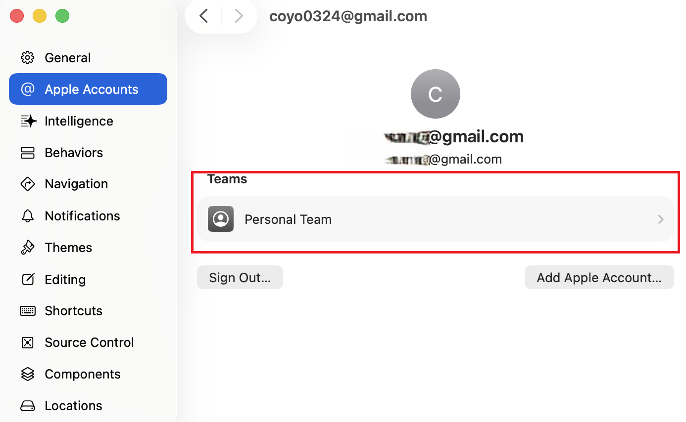
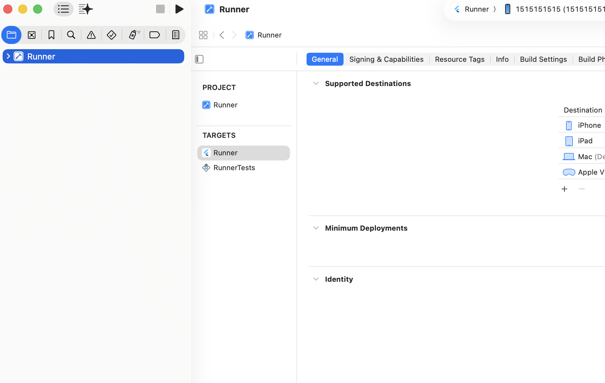
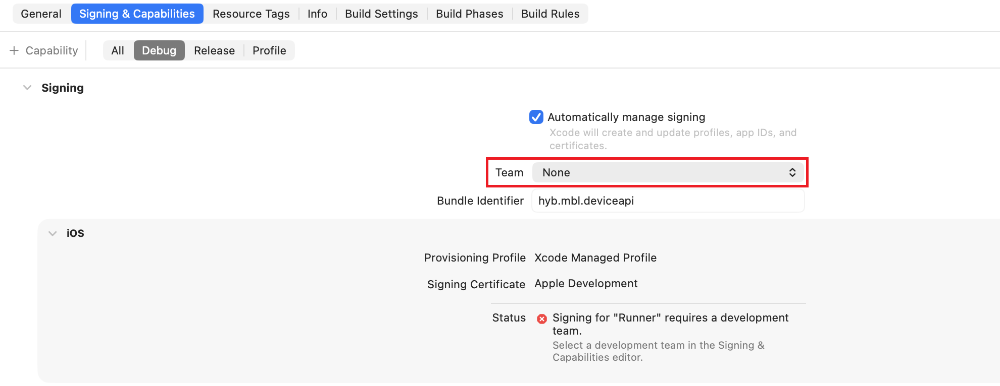
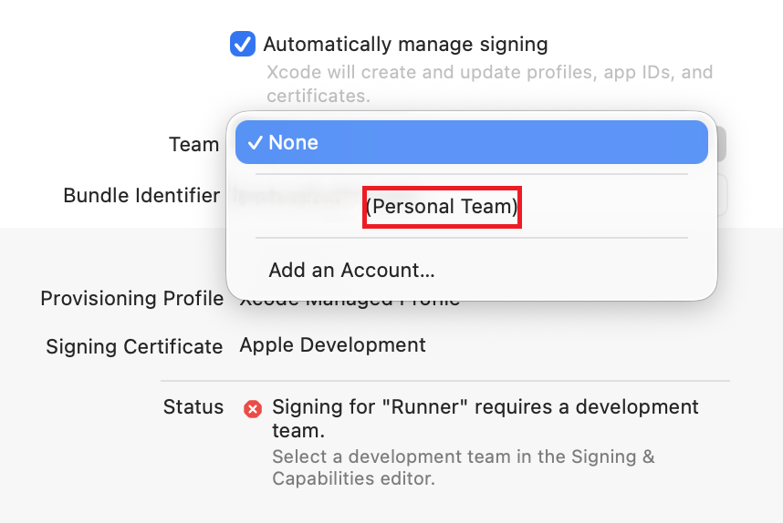
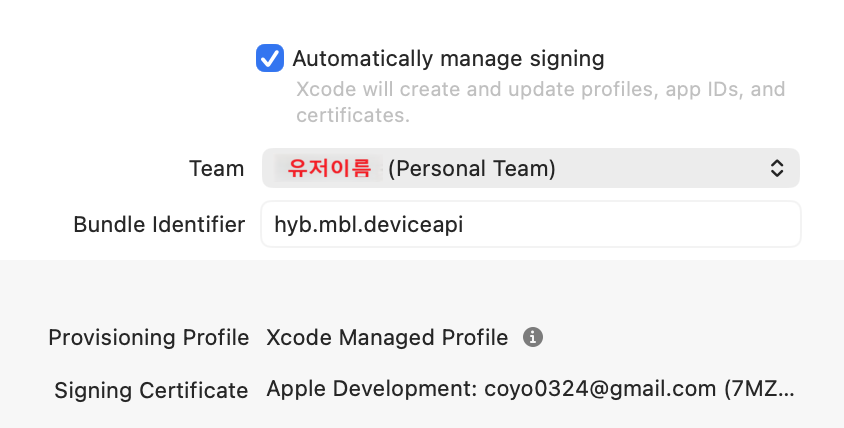
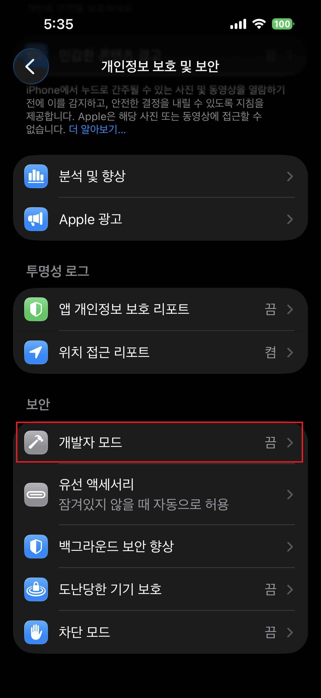
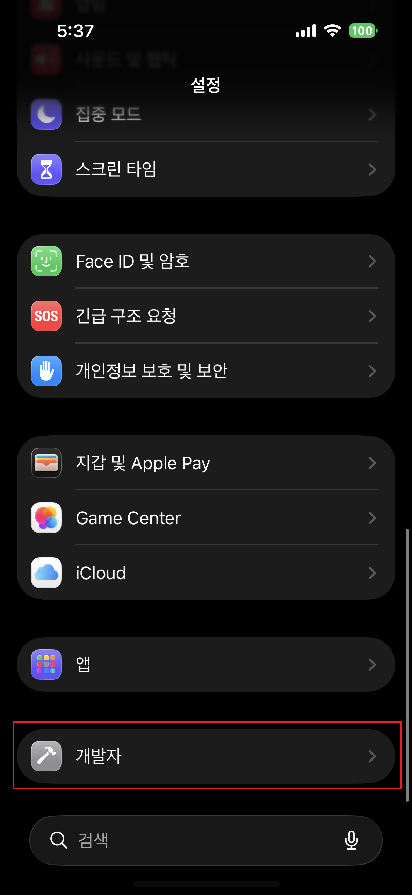
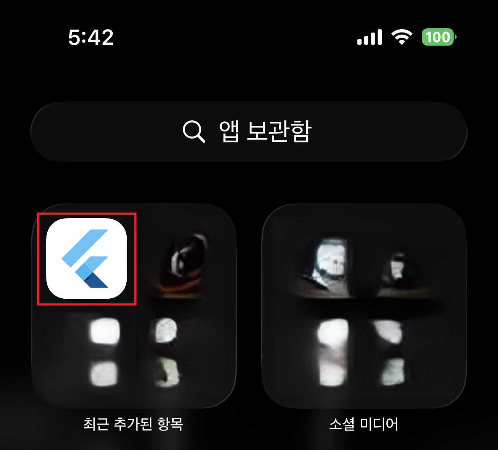

# 실기기에 Build 및 Test 하는 방법
해당 가이드에서는 Android와 IOS 핸드폰에 Build 하는 방법에 대해서만 안내합니다.</br>
실기기가 아닌 Emulator를 통해 Build 하는 방법은 아래 URL을 참고하세요.</br>
>[Android Studio Emulator 설치 및 설정](./emulator.md)

## Android

### 1. Google USB Driver 설치
### 2. 디바이스별 USB 드라이버 다운로드 
### 3. 개발자 모드 활성화
설정 > 최하단의 휴대전화 정보 > 소프트웨어 정보 > 빌드번호를 빠르게 7번 연속 터치 
- "개발자 모드를 켰습니다" 라는 문구 확인
- 설정으로 나와 최 하단에 '개발자 옵션' 메뉴가 활성화 되었는지 확인
- 사용이 종료되면 토글 버튼을 OFF 하기


### 참고
[안드로이드 스튜디오 Docs](https://developer.android.com/studio/run/device?hl=ko)

## IOS
- IOS에서 기기로 디버깅을 하기위해서는 Apple 개발자 계정이 필요합니다.
- apple에서 디버깅용도의 무료 코드사인 방법을 제공합니다.
- XCode 프로그램이 필요합니다 (최신버전 권장)

[Apple 개발자 계정 도움말](https://developer.apple.com/kr/help/account/)

### 1. Xcode에서 계정 등록
- 상단 메뉴 Xcode > Settings 로 진입
    

- Apple account 등록
    
    계정이 등록되어 있지 않으면 하단의 "Add Apple Account"로 등록

- 등록된 account의 Team 확인
    
    - 등록한 계정을 눌러서 상세 정보 확인
    - "Personal Team" 이 apple developer에서 제공하는 무료 플랜입니다.


### 2. Xcode에서 Runner.xcodeproj 실행
- Runner.xcodeproj 실행
*build 문제가 있는 경우 Runner.xcworkspace를 실행
    
    - 좌측 메뉴 Target에서 'Runner'를 확인합니다.
    - Target에 Runner가 보이지 않는 경우 pod 설치를 확인하거나 flutter pub get을 재설치 해보시기 바랍니다.
    ```ps1
    # podfile이 있는 경로 (/프로젝트/ios/)
    pod deintegrate
    pod install

    # 프로젝트 root 경로 (/프로젝트)
    flutter clean
    flutter pub get
    ```

### 3. Code Signing 진행하기
- Runner에서 Signing & Capabilities 탭으로 이동
    
-Team을 "Personal Team" 으로 변경
    
    - 위쪽에서 생성한 계정의 이름이 표시됩니다. (이메일 x)
    - 계정이 없는 경우 1번부터 다시 진행하거나 Add an Account를 눌러 계정을 등록하세요.

- 설정된 값을 확인
    
    - Bundle Identifier는 변경하지않아도 되지만 중복에러가 발생하는 경우 변경할 수 있습니다.

### 4. Build 
- Xcode 상단 또는 좌측의 '▶' 버튼을 눌러 build를 진행합니다
- 또는 flutter run -d <연결한 device명> 을 이용해 프로젝트를 기동시킵니다.

### 5. 개발자 모드 활성화
테스트용 앱을 실기기에서 사용하기 위해서는 개발자 모드를 활성해야합니다.
- 1) 개발자 모드 활성화(설정 > 개인정보 보호 및 보안)
    
        - 메뉴 최하단에서 개발자 모드 클릭합니다.
        - 토글버튼을 눌러 개발자 모드를 활성화 합니다.
        - 개발자모드를 활성화 시 보안에 대한 안내 문구가 나오면 '동의'

- 2) 개발자 모드 활성화 확인(설정)
   
        - 개발자모드가 활성화되면 설정 최하단에 개발자 메뉴가 활성화됩니다.<br>
            (*확인이 어려운경우 검색 기능을 이용해 '개발자' 검색 후 확인)

- 3) application 신뢰 설정 (일반 > vpn 및 기기 관리)
    
        - flutter build가 진행되면 code signing을 진행한 이메일로 등록된 app을 확인 가능합니다.
        - 첫 등록시 '신뢰할 수 없음'상태
    
        - 해당 app을 클릭해서 '신뢰' 버튼을 클릭합니다.
        - 개발자의 앱 부분에 build한 앱이 출력되면 정상적으로 build가 완료된 상태입니다.

### 6. 앱 실행

- build된 app을 확인해서 실행합니다.
- 실행이 되지 않는 경우 xcode에서 flutter run을 다시 실행해보시기 바랍니다.
    
---
[Apple 개발자로 등록하기](https://developer.apple.com/kr/register/) <br> : 실제 스토어에 앱 배포 등을 위해서는 유료 결제가 필요합니다.

무료로 진행하는 방법
Personal Team 