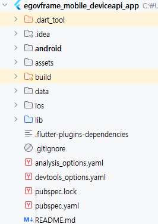
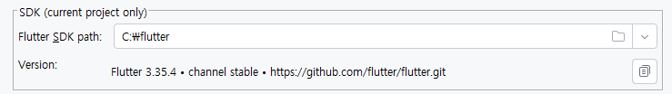
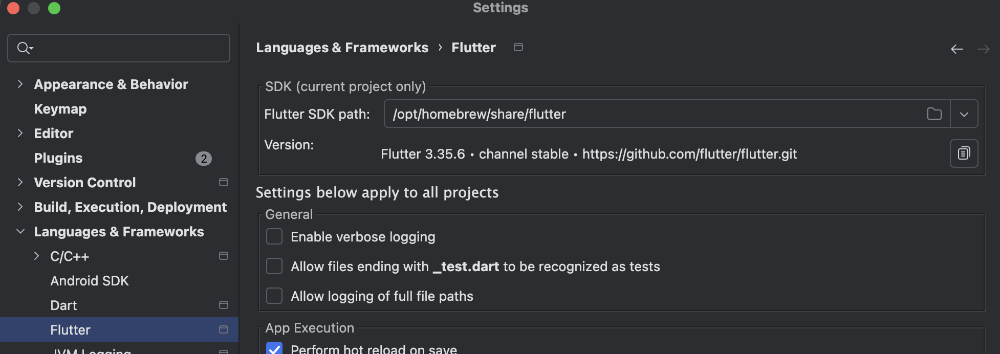
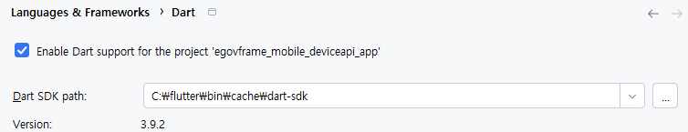
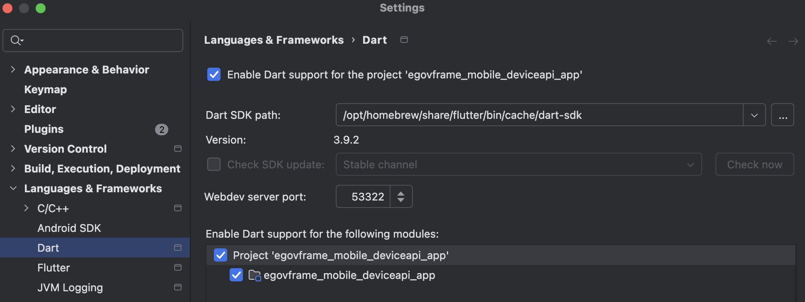
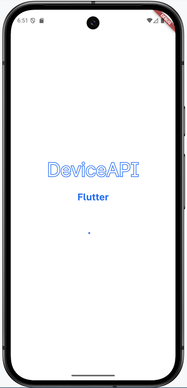
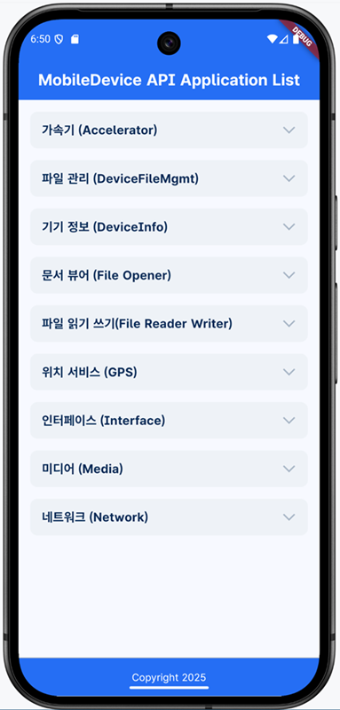

# Flutter 기반 DeviceAPI 프로젝트 시작하기

## 1. 프로젝트 실행

- 메인화면에서 Open > 모바일 프로젝트(egovframe-mobile-deviceapi-app) 선택 후 Open
- Android SDK가 설치되어있는 경우 프로젝트의 아이콘이 Android로 표시</br>
  

## 2. Flutter 설정 확인

프로젝트 실행 후 프로젝트의 영역이 Flutter가 아닌 Android나 일반 프로젝트 형태로 Build 되어 있는 경우 Flutter 및 Dart 설정에 대한 확인이 필요함

### 1) Flutter 프로젝트 확인



- 프로젝트 좌측에 Flutter 아이콘이 있는지 확인
- data , lib, pubspec.yaml 등 flutter 관련 파일이 존재하는지 확인
- Flutter 프로젝트가 아닌 경우 2,3번 문제 확인

### 2) Flutter / Dart 경로 확인

- 메뉴바에서 File > Settings > Language & FrameWorks > Flutter 또는 Dart

#### Flutter

- [Settings 1.Flutter 설치](./settings.md)에서 지정한 경로에 Fluttr가 지정되어있는지 확인
  - Window
    
  - macOS
    

#### Dart

- Window
  
- macOS
  
  - Enable Dart support for the following modules 내부 프로젝트 체크 표시
  - macOS의 경우 추가 설정 [Dart SDK is not specified](./settings.md#2-dart-sdk-is-not-specified) 참조

## 3. 라이브러리 확인

### pubspec.yaml

- `pubspec.yaml` 파일에 사용하고있는 flutter API 확인</br>
  각 사용하고 있는 API에 대한 설명은 [모바일 아키텍처](https://www.egovframe.go.kr/home/sub.do?menuNo=98) 하단의 오픈소스 사용현황에서 확인 가능

- pubspec에 정의된 라이브러리 호출
  ```ps1
  flutter clean
  flutter pub get
  ```
    *프로젝트 Open시 Build를 진행하지만 라이브러리를 불러오지 못해 에러표시가 생기는 경우 실행

## 4. Device 기동
Device Manager 에서 Device 기동</br>
*[Android Studio Emulator 설치 및 설정](./emulator.md#2-안드로이드-애뮬레이터-설치) 참고

## 5. Flutter 실행
Emulator(Virtual Device) 를 미리 실행시켜 두어야 목록에서 확인 가능

### 방법 1) 상단 메뉴바에서 실행
</br>
- Select Box에서 실행 가능한 Device 선택
- 상단의 '▷' 버튼을 눌러 Flutter 실행

### 방법 2) 명령어로 실행
- 실행가능한 디바이스 검색
    ```ps1
    flutter devices
    ```
    =실행결과
    ```ps1
    Found 4 connected devices:
    sdk gphone16k x86 64 (mobile) • emulator-5554 • android-x64    • Android 16 (API 36) (emulator)
    # 현재 OS 및 설치되어있는 브라우저가 목록에 표시 (Windows, Chrome 등)
    ```
    emulator-5554가 DeviceID이므로 복사

- 명령어로 실행
    ```ps1
    # flutter run -d <DeviceID>
    flutter run -d emulator-5554
    ```
- 종료시키는 경우엔 터미널에서 Ctrl + C 

## 6. 실행 완료 화면
- 초기 시작시 Loading 화면</br>
    *applist 화면이 로딩되면 페이지전환 </br>
    

- DeviceAPI Application 9종 화면</br>
    

## 7. WebServer와 연동
연동 서버를 열지 않아도 Flutter 앱은 기동 가능</br>
Flutter 서버와의 연동을 위해 웹서버 기동 후 설정 필요</br>
    *[DeviceAPI 연동 WebServer 기동](./webserver.md) 참고

### 1) baseUrl 설정

`lib > config > app_config.dart`
- 기본값 : `static const String baseUrl = 'http://10.0.2.2:9700';`
- WebServer 기동 시 로컬이 아닌 다른 서버에서 기동한 경우 변경 필요 (IP 또는 서버, 포트번호 확인)
- 또는 개발용 url 설정
    ```dart
    // 개발/운영 환경별 설정 (필요시 확장 가능)
    static const String devUrl = '사용할 서버 URL';
    
    static String get currentBaseUrl {
        return devUrl;
    }
    ```
- 변경 후 Clean > Build 실행
    ```ps1
    flutter clean
    flutter pub get
    ```

### 2) 로컬 Web서버가 아닌 다른 서버를 이용하는 경우

https가 아닌 http 로 통신을 하는 경우 보안문제로 인해 개발 IP만 허용되도록 설정 </br>
운영환경에서는 해당 기능을 주석처리하거나 삭제 필요

- 기본값으로 localhost(127.0.0.1)로 기동된 서버에 대한 값은 허용

#### Android
>IP 설정: `android/app/src/main/res/xml/network_security_config.xml` 
```xml
    <!-- 특정 도메인/IP에 대해서만 HTTP 허용 -->
    <domain-config cleartextTrafficPermitted="true">
        <!-- 개발 서버 IP -->
        <domain includeSubdomains="true">허용할 개발 PC의 IP</domain>

        <!-- Android 에뮬레이터용 localhost -->
        <domain includeSubdomains="true">10.0.2.2</domain>
        <!-- 로컬 개발용 -->
        <domain includeSubdomains="true">localhost</domain>
        <domain includeSubdomains="true">127.0.0.1</domain>
    </domain-config>
```
- `<domain includeSubdomains="true">`를 통해 통신을 진행할 서버의 도메인 값을 추가

> 설정 추가 : `android/app/src/main/AndroidManifest.xml`
```xml
<application android:networkSecurityConfig="@xml/network_security_config">
```
https로 통신하는 production의 경우 해당 설정을 삭제하거나 주석 처리

#### IOS
> 설정 파일 : `ios/Runner/Info.plist`
```xml
	<!-- 네트워크 보안 설정 -->
	<key>NSAppTransportSecurity</key>
	<dict>
		<key>NSAllowsArbitraryLoads</key>
		<false/>
		<key>NSExceptionDomains</key>
		<dict>
			<key>허용할 개발 PC의 IP</key>
			<dict>
				<key>NSExceptionAllowsInsecureHTTPLoads</key>
				<true/>
				<key>NSExceptionMinimumTLSVersion</key>
				<string>TLSv1.0</string>
			</dict>
			<key>localhost</key>
			<dict>
				<key>NSExceptionAllowsInsecureHTTPLoads</key>
				<true/>
			</dict>
			<key>127.0.0.1</key>
			<dict>
				<key>NSExceptionAllowsInsecureHTTPLoads</key>
				<true/>
			</dict>
		</dict>
	</dict>
```
- `NSExceptionAllowsInsecureHTTPLoads`로 접근을 허용할 IP를 <key>에 작성
- Production 배포시 해당 설정 파일 주석/삭제 처리

## 연관 가이드

- [Flutter 설치가이드](./settings.md)
- [Android Studio Emulator 설치 및 설정](./emulator.md)
- [DeviceAPI 연동 WebServer 기동](./webserver.md)