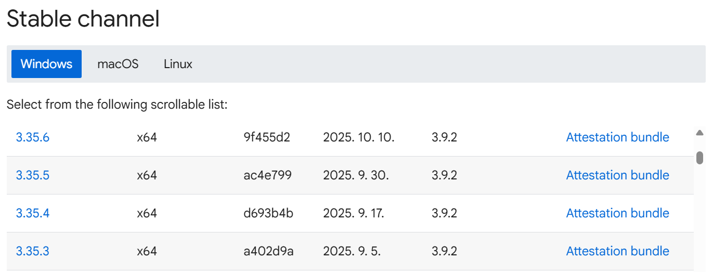
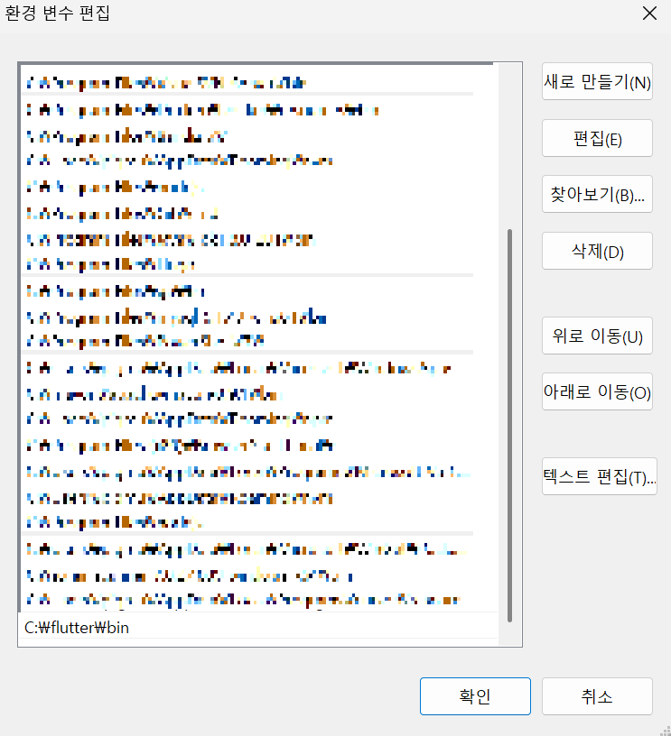
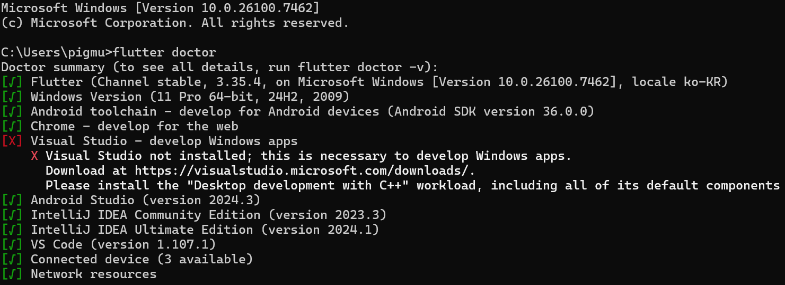
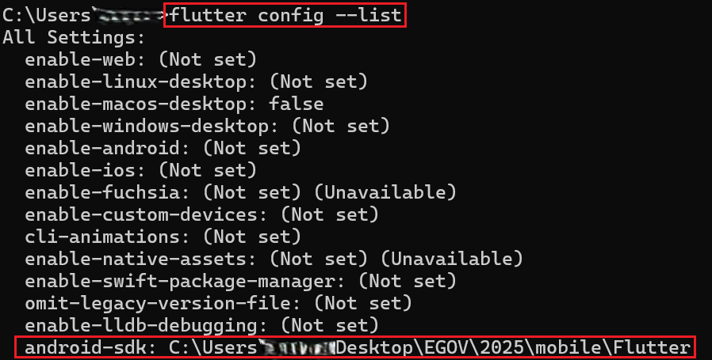
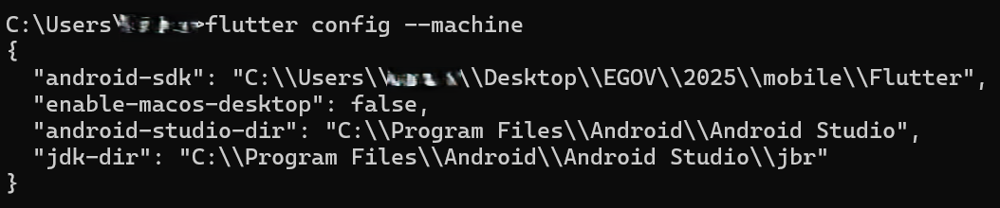
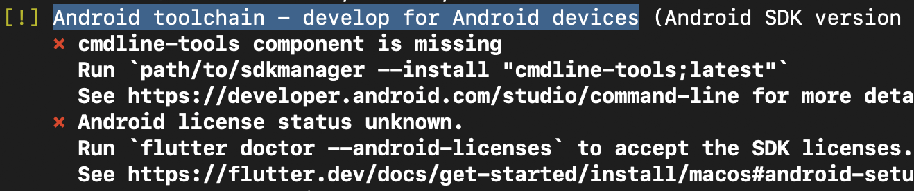
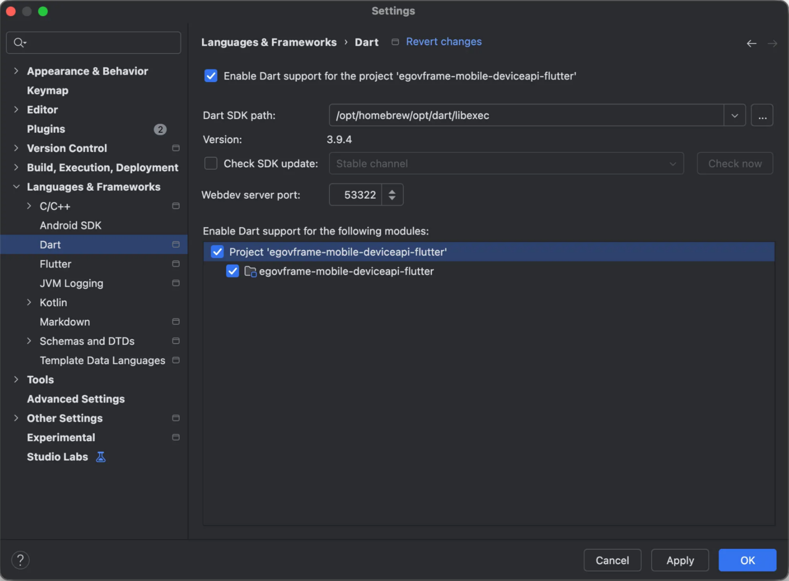

# Flutter 설치 가이드

Egovframework DeviceAPI (Application) with Flutter 를 사용하기 위해 Flutter 설치에 대한 가이드를 제공합니다.</br>
OS별 설치 및 환경설정 방법이 상이하므로 각 OS 버전에 맞추어 설정을 진행하시기 바랍니다.

## 0. 환경

Egovframework DeviceAPI (Application) with Flutter를 사용하기 위한 최소 환경 요구 사항입니다.</br>
Flutter, Dart, Android, OS 버전 등에 대해 기술합니다.

### 버전

- Flutter 3.35.4 이상
- Dart 3.9.2 이상
- Android SDK 24 이상
- IOS 버전 16이상

### 애뮬레이터 / 시뮬레이터

- Android Studio Amulator : Android 7.0 (Nougat 7.0) 이상
- IOS Simulotor : IOS 16 이상
  - Simulator의 경우 보안문제로 인해 Camera, Accelerator 테스트 불가

## 1. Flutter 설치

프로그램을 직접 Flutter 공식 홈페이지에서 다운로드 하는 방법과 Homebrew 명령어를 통해 설치하는 방법을 안내합니다.</br>
본 프로젝트의 경우 원활한 테스트를 위해 Android Studio를 이용한 개발방법을 기반으로 하고 있습니다.

### 1) Flutter 홈페이지를 통해 설치

- [Flutter Install Archive](https://docs.flutter.dev/install/archive)
   
- Dart 3.9.2 이상 Flutter Version 사용 가능 - 헤당 프로젝트에서는 3.35.4를 사용하였으나 3.35.3도 사용 가능 - Windows, macOS, Linux 별 bundle 제공</br>
  *macOS, Linux의 경우 Terminal 을 이용한 설치가 더 간편

- Window OS의 경우 다운로드 후 환경변수 등록 필요
  - 제어판 > 시스템 속성 > 환경 변수
     - 환경변수

### 2) Homebrew를 이용한 설치

```ps1
$ brew install -cask flutter
```

flutter 최신버전 다운로드 됨</br>
\*macOS의 경우 FVM (Flutter Version Managemnet)를 이용해 버전을 관리할 수도 있음

## 2. Flutter 설치 확인

### 1) 설치 확인

```ps1
$ flutter doctor
```

- `flutter doctor -v` : 버전 등 자세한 정보 확인 가능
- `flutter doctor -vv` : 자세한 디버깅 확인 (확인 소요 시간 출력)

- `flutter doctor`를 실행한 결과
   - Flutter 설치 체크 및 설치된 버전 확인 - \*VS Code, IntelliJ, Android Studio는 필요 시 다운로드 '[X]'체크되어있어도 실행에는 지장 없음

### 2) Android SDK, 라이센스 등록

- Android 를 통해 테스트하는 경우 Android SDK 등록</br>
  ```ps1
  $ flutter config —android-sdk <SDK 경로>
  ```
  \*Android Studio 이용 시 Settings에서도 설정할 수 있으나 flutter doctor 상 오류 처리 </br>
- 등록된 SDK 경로 확인

  ```ps1
  $ flutter config --list
  ```

  

- flutter 와 연결된 machine들의 버전 확인

  ```ps1
  $ flutter config --machine
  ```

  

## 3. 오류

해당 오류들은 Android Studio를 이용해 개발/테스트를 진행하는 경우 발생</br>
Andorid SDK 경로 설정, Dart 경로 설정 등의 오류

### 1) Android ToolChain Error (라이센스가 미동의 처리 된 경우)



- 동의가 되어있지 않은 경우 flutter doctor에서 'Android toolchain'에 에러 표시</br>
  \*Run `flutter doctor ...` 로 표시된 명령어 확인
- 라이센스 동의
  ```ps1
  $ flutter doctor —android-licenses
  ```
  명령어 입력 후 질문이 나오면 'y'를 눌러 동의
- 다시 `fluuter doctor`를 실행해서 에러가 해결되었는지 확인

### 2) Dart SDK is not specified

\*macOS에서 Dart SDK 경로를 찾지 못하는 에러

- Dart SDK 경로 확인

  ```ps1
  $ brew info flutter
  ```

  또는 `flutter doctor`로 flutter가 설치된 경로 확인 (flutter 설치 시 내부에 dart sdk 내장되어있음)
  - Dart SDK 경로 : flutter 설치 경로 + /bin/cache/dart-sdk</br>
    \*ex) /opt/homebrew/share/flutter/bin/cache/dart-sdk
  - 해당 경로 복사

- Android Studio > Settings (또는 Preferences) > Language & Frameworks > Dart
  
  - Enable Dart Support for the project 체크박스 활성화
  - 복사한 경로를 Dart SDK Path에 붙여넣기
  - Enable Dart support for the following modules 체크박스 활성화


## 연관 가이드

- [Android Studio Emulator 설치 및 설정](/emulator.md)
- [프로젝트 시작하기](/project_start.md)
- [DeviceAPI 연동 WebServer 기동](/webserver.md)
